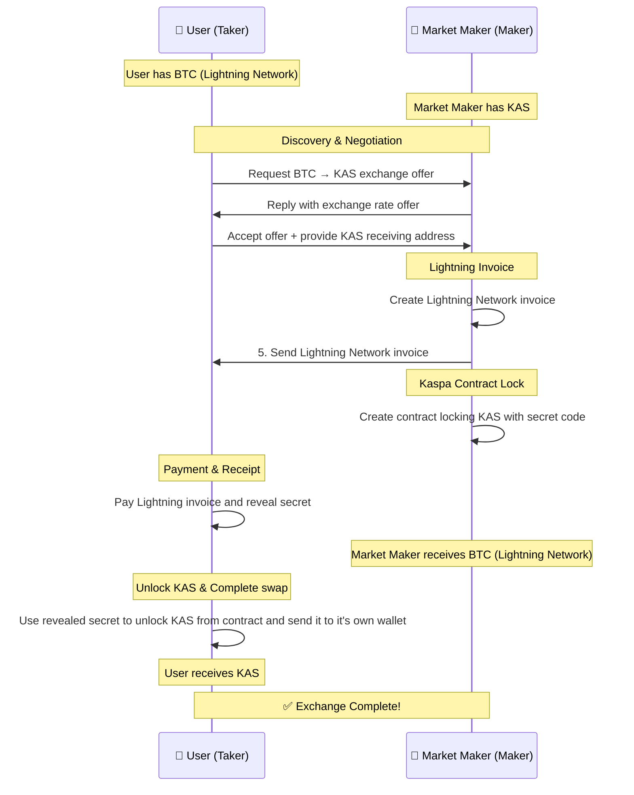

## 🔄 BTC-KAS Atomic Swap Platform
### *Bridging Bitcoin and Kaspa Without Boundaries*

---

### What are Atomic Swaps?

Atomic swaps are "digital agreement" that ensures both parties get what they agreed to, or no one gets anything.

The process is **fully trustless**: through the complete process, users don't need to trust anyone.

### Getting Started:
**Requirements:** 
- `tor` is required 
- a personal `kaspad` node is highly recommended.
- any LN wallet for receiving sats. For sending payments, make sure the wallet displays the payment preimage. (Makers currently need LND/lncli)
- any Kaspa wallet. (Makers currently need Golang kaspawallet)

Directly install from GitHub:

    # It's recommended to use a virtual environment
    python3 -m venv venv
    source venv/bin/activate
    # Install with pip
    # PyPi release is not currently available, the UI PoC was build with a dev version of kivyMD
    pip3 install git+https://github.com/LordStapy/satkas

Or, download and install from source:

    git clone https://github.com/LordStapy/satkas.git
    cd satkas
    # start a virtual environment
    python3 -m venv venv
    source venv/bin/activate
    pip3 install .

#### Start the UI app:

    satkas

**SatKas is experimental software, test it with small amounts of KAS and sats!**

Alternatively, the `examples` directory contains few scripts showing how to use the libraries, including running a Maker or a Taker from the command line.
You will need to copy the `example.env` file to `.env` and adjust the parameters to your needs.

Note: running a Maker requires extra dependencies and some coding skills, I don't recommend it at this stage. 

### How It Works
Here is a simplified schema of how the exchange happens:

Swaps work in **both directions**, users can exchange:
  - Bitcoin (LN) ---> KAS 
  - KAS ---> Bitcoin (LN)

### Contribute:

#### **Provide Feedback**
- What features do you need most?
- What concerns do you have?
- How would you use this platform?

#### **Test the Platform**
- Try the current proof of concept
- Report bugs and issues
- Share your experience

#### **Vote on Features**
- Help prioritize development
- Suggest new capabilities
- Shape the roadmap

---

Questions? Feedback? Criticisms? Suggestions? Tag me (@lordstapy) in Kaspa Official Discord server (votes-and-funding-discussions channel - https://discord.com/channels/599153230659846165/1032411383347826748)
