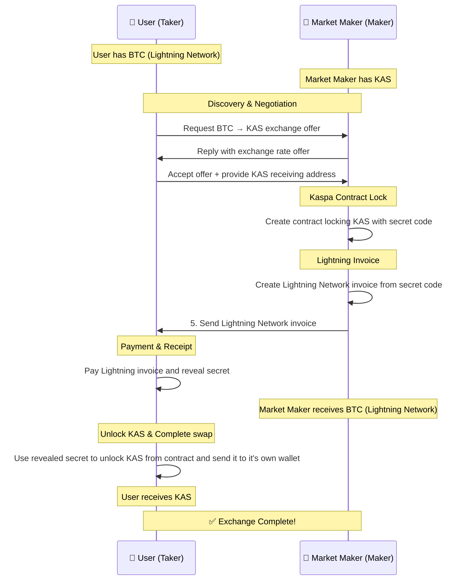
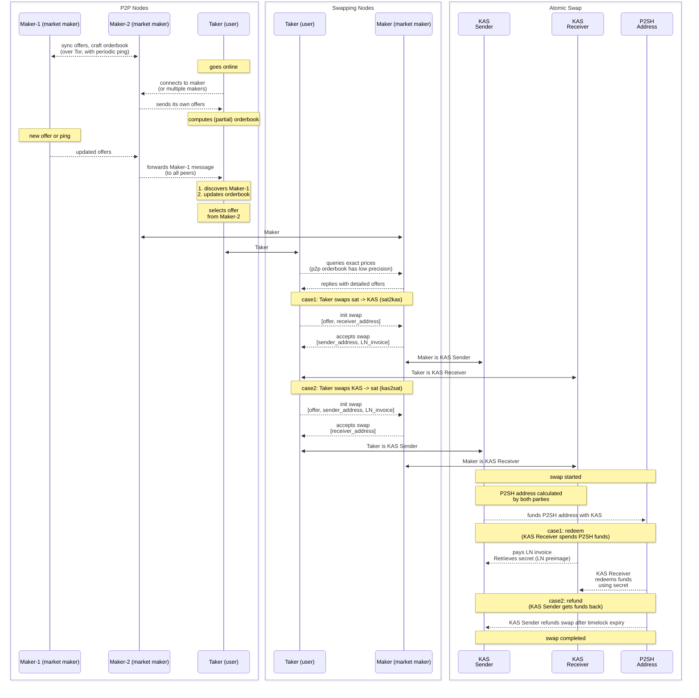

# 🔄 BTC-KAS Atomic Swap Platform
## *Bridging Bitcoin and Kaspa Without Boundaries*

[](https://github.com/LordStapy/satkas)
[](#)
[](#)

---

## 🚀 **What is This?**

This is a **proposal** for a **truly decentralized exchange platform** between Bitcoin and Kaspa - two of the most innovative blockchain networks focused on decentralization and freedom.

**Let's say you want to exchange Bitcoin for Kaspa. You will be:**
- ❌ Creating accounts on centralized exchanges
- ❌ Going through lengthy KYC procedures  
- ❌ Trusting third parties with your funds
- ❌ Paying high fees and waiting hours

**But, in all reality, you want to**:
- ✅ Exchange directly with another person (no centralized third parties involved)
- ✅ Complete the swap quickly
- ✅ Stay completely anonymous
- ✅ Keep full control of your funds at all times
- ✅ Pay minimal fees

---

## 🔍 **The Problem We're Solving**

### The Contradiction

Both **Bitcoin** and **Kaspa** were built on the same core principles:
- **Decentralization** - No single point of control
- **Permissionless access** - Anyone can participate
- **Censorship resistance** - No one can block your transactions
- **Peer-to-peer value exchange** - Direct transfers between users

### The Current Reality

When you want to exchange Bitcoin for Kaspa today, you're forced to use **Centralized Exchanges (CEX)** that:

- Are controlled by companies subject to government regulations
- Require extensive KYC/AML compliance
- Can freeze your funds or block your access
- Create single points of failure that could lead to loss of funds or leak of private informations
- Charge high fees
- Take time to process, sometimes hours or even days

**This is completely contradictory to the principles both networks represent!**

---

## 💡 **Our Solution: Atomic Swaps**

### What are Atomic Swaps?

Think of it as an **"automatic digital agreement"** that ensures both parties get what they agreed to, or no one gets anything. It's like having a perfectly neutral, honest and decentralized robot that:

1. Takes both Bitcoin and Kaspa directly from users
2. Verifies both payments are valid
3. Exchanges them simultaneously
4. Returns everything if something goes wrong

And everything is **completely trustless**: through the complete process, you don't need to trust anyone.

### How It Works
Here is a simplified schema of how the exchange happens:




#### **IMPORTANT REMINDERS**

- **Anyone** can be be a User (Taker) 👤.
- **Anyone** can be be a Market Maker (Maker) 🏪.
- Atomic swaps are available in **both directions**:
  - Bitcoin (LN) ---> KAS
  - KAS ---> Bitcoin (LN)


### The Magic Behind It

- **Bitcoin side**: Uses the Lightning Network for instant, low-fee transactions
- **Kaspa side**: Leverages native transaction scripting capabilities
- **No Smart Contracts**: Works entirely on Layer 1 - no additional complexity needed
- **Trustless**: Mathematics and cryptography ensure fairness, not trust in people

---

## 🛠️ **What's Already Built**

### ✅ **Proof of Concept - LIVE NOW**

#### Current Features:
- **Basic P2P Network**: Decentralized orderbook running on TOR for privacy
- **Bi-directional Swaps**: BTC Lightning ↔ KAS in both directions
- **Automated Market Makers**: Liquidity providers run continuously
- **User-friendly Takers**: Join, swap, and leave whenever you want
- **Third-party wallets**: Takers may use their preferred KAS and LN wallets (avoid custodial wallets! LN wallet must show the payment preimage to the user)
- **Complete Anonymity**: No registration, no KYC, no data collection
- **Lightning Fast**: Swaps complete in under 40 seconds

#### Technical Components:
- **Python-based** core library
- **Custom scripting** support for Kaspa P2SH transactions
- **Atomic swap logic** implementation
- **Swapping nodes (Maker/Taker)** for swap negotiation and execution
- **P2P networking** for decentralized orderbook
- **CLI interface** for all operations

#### Technical flow:
Here is a schema of how the components of the platform interacts between each others:




---

## 🚀 **What's Coming Next**

If this proposal is accepted by the community, here's what we'll build:

### 🎯 **Planned Core Features**

#### 🔧 **Developer Tools**
- **Complete API**: Let developers build their own tools and integrations
- **Comprehensive Documentation**: Easy setup guides for everyone and API reference
- **SDK & Libraries**: Integrate swaps into other applications

#### 🖥️ **User Experience**
- **Desktop Application**: Easy-to-use desktop interface
- **Web Interface** *(Alternative to the Desktop Application, Community feedback needed!)*: Browser-based user interface
- **Mobile Support**: Trade from anywhere

#### 🛡️ **Security & Stability**
- **Anti-spam Protection**: Prevent network abuse (for market makers)
- **Enhanced P2P Layer**: More robust networking between market makers and users

#### ➕ **Full size**
- **On-chain BTC Support**: Swap regular Bitcoin (not just Lightning Network)

### 💡 **Community-Driven Features**

We want **YOUR** input! What features would you like to see? Some ideas we could discuss:

- **Price Discovery Tools**: Real-time market data
- **Trading Bots**: Automated trading strategies
- **Analytics Dashboard**: Trading history and statistics

---

## 🌟 **Why This Matters**

### 🔓 **True Decentralization**
No more relying on centralized exchanges that can:
- Block your access
- Freeze your funds
- Require personal information
- Shut down unexpectedly

### 🌍 **Global Access**
Available to anyone, anywhere:
- No geographic restrictions
- No account requirements
- No minimum trading amounts
- No business hours

### ⚡ **Superior Performance**
- **Speed**: 40 seconds vs hours on traditional exchanges
- **Fees**: Minimal network fees only
- **Privacy**: Complete anonymity
- **Reliability**: No single point of failure

### 🛡️ **Security First**
- Your keys, your coins - always
- No custody risk
- No exchange hacks possible
- Cryptographic guarantees

---

## 🧪 **Try It Today**

The proof of concept is **already live** and working on mainnet! 

### Requirements:
- kaspad (a running Kaspa node, please avoid using public nodes at this time)
- Tor

#### Optional requirements for Makers (or for enhanced swap speed):
- lnd/lncli
- kaspawallet

    **Hint**: use a segregate wallet for testing, there's a dedicated entry in the config file. 

### Getting Started:
1. Download and setup
    ```
    git clone https://github.com/LordStapy/satkas.git
    cd satkas
    # start a virtual environment
    python3 -m venv venv
    source venv/bin/activate
    pip3 install .
    cp example.env .env
    ```
2. Edit the `.env` configuration file, the example file has some comments, let me know if this is not clear
3. Use one of the scripts in the examples folder to test the swap and library functionality:
    
      #### Complete Atomic Swap

     Allows the user to fetch the different offers from available market makers and to perform the complete swap.

     The script will automatically join the p2p network and sync the orderbook, then you can select a price to see all detailed offers (p2p orderbook offers are rounded to integer sats), finally you will be prompted to input the amount and confirm the swap.

     On the first run you will be prompted to set a password for the internal wallet.

     **IMPORTANT**: this requires all "optional requirements" listed above.
     Dummy UI is made with _curses_, a basic terminal UI library already available on python for Linux.

     Run it with:
     ```
     python3 taker_dummy_ui.py
     ...
     ```

     #### Advanced scripts
   - **Step by step**
   
     Execute the `manual_swap.py` script to manually perform an atomic swap with known parameters, for testing or learning
   - **Quick Swap**
     
     Use `taker_quick_swap.py` to directly connect to a maker endpoint, the script automatically selects the best offer.
   
     You can specify an endpoint when running the script.  
      ```
      python3 taker_quick_swap.py [maker-endpoint]
      ...
      ```
   - **Run a Maker**

     `maker_example.py` contains an example for running a Maker with p2p sync and automatic offers update (check code comments for more flavours)
   #### Library examples
    
   - **sweep_privkey.py**
    
     Spend funds from a known private key using the library
   - **kip10_additive_address.py**
   
     KIP10 scripting transactions with borrower or threshold scenario

*Test it with small amounts of KAS and satoshis*

---

## 🤝 **Join the Movement**

This isn't just about building software - it's about **preserving the core values** that make Bitcoin and Kaspa special.

### How You Can Help:

#### 💬 **Provide Feedback**
- What features do you need most?
- What concerns do you have?
- How would you use this platform?

#### 🧪 **Test the Platform**
- Try the current proof of concept
- Report bugs and issues
- Share your experience

#### 🗳️ **Vote on Features**
- Help prioritize development
- Suggest new capabilities
- Shape the roadmap


### 📋 **Next Steps**
1. **Community Feedback** - Share your thoughts and suggestions
2. **Proposal Refinement** - Incorporate community input
3. **Final Proposal** - Present the complete plan with timeline and budget (for community funding)
4. **Development Begins** - Start building the future of decentralized trading

---

Questions? Feedback? Criticisms? Suggestions? Tag me (@lordstapy) in Kaspa Official Discord server (votes-and-funding-discussions channel - https://discord.com/channels/599153230659846165/1032411383347826748) - let's build this together!