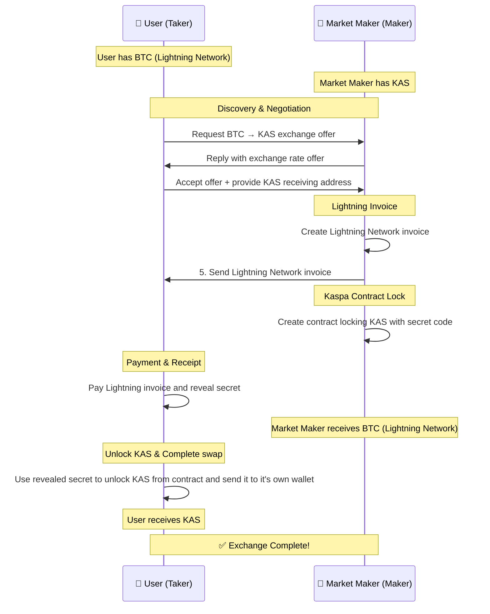
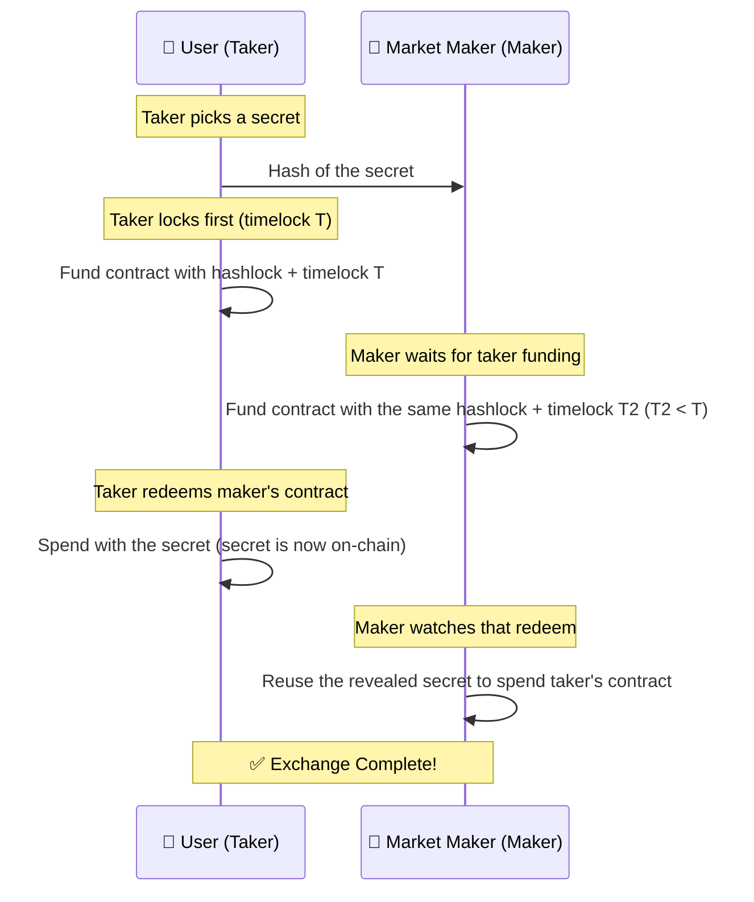

### How It Works

Here is a simplified schema of how the LN exchange happens:

On-chain swaps (BTC ↔ KAS) skip Lightning. Negotiation is omitted below: the quote is already accepted.

The same sequence is used in both directions; the taker always locks first.

If the taker never redeems, T2 expires first so the maker refunds, then T expires so the taker refunds. T2 must be shorter than T: otherwise the taker could refund their own lock at T and still redeem the maker's lock with the secret.

### Notes

- Both parties derive each contract address from the same public parameters (secret hash, keys, timelocks). Neither side needs to trust an address the other sends.
- Maker quotes include a base rate and network fees. Makers provide liquidity; takers pay the fees.
- On-chain only: the taker chooses the secret and never sends it. The maker only learns it from the taker's redeem transaction.
- On-chain only: the maker does not fund until the taker's lock is seen on-chain. If the taker never funds, the maker never locks coins.

